# 第02章 统计调查

> **图文一体**：文字笔记在下方；**课件每一页**见文末「配套课件（逐页图示）」。用 Markdown 预览即可，无需打开 pptx。

## 本章在干什么

解决数据**从哪来、怎么来、质量如何保证**；输出可供第3章整理、显示用的原始或次级资料。

**大纲结构**：① 统计调查概述 ② 调查组织方式 ③ 数据整理（第3章）④ 方案设计 ⑤ 预处理 ⑥ 调查误差。

## 本章知识点树（总览 · 自上而下）

> 看章节骨架。下一节为**左→右知识导图**（含公式与题眼）。

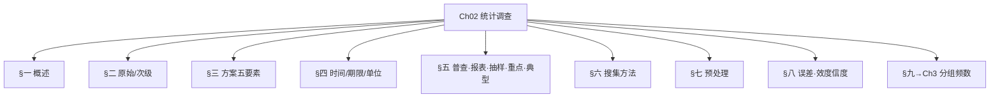

## 本章知识导图（左 → 右 · 对照笔记 § + 先读考点）

> **用法**：每章分 **上/中/下** 条带，条带内**从左往右**读；节点标注 **§ 小节号**（与正文一致）。含公式、题眼、易混提示。章内若仍觉缺项，以正文 § 为准补看。

```mermaid
flowchart TB
  T1["Ch02 · 上（§一～§五）"]
  subgraph R1[" "]
    direction LR
    R((调查)) --> A1["§一 概述"]
    A1 --> A1a["调查目的性·科学性"]
    R --> A2["§二 资料"]
    A2 --> A2a["原始 一次D"]
    A2 --> A2b["次级 网站年鉴C"]
    A2 --> A2c["整理用 原+次C"]
    R --> A3["§三 方案ABCDE"]
    A3 --> A3a["目的=解决啥问题C"]
    A3 --> A3b["对象·单位·项目"]
    A3 --> A3c["调查表·指标口径"]
    R --> A4["§四 时间期限"]
    A4 --> A4a["时间=资料所属"]
    A4 --> A4b["期限=干活多久B"]
    A4 --> A4c["普查标准时点A"]
    A4 --> A4d["单位≠报告单位"]
    R --> A5["§五 组织方式"]
    A5 --> A5a["普查 BCE"]
    A5 --> A5b["报表+普查 DE"]
    A5 --> A5c["重点 80%销售"]
    A5 --> A5d["典型 农村 麻雀AC"]
    A5 --> A5e["抽样 寿命 等距D"]
  end
  T1 --> R1
  T2["Ch02 · 下（§六～§九）"]
  subgraph R2[" "]
    direction LR
    R --> B1["§六 搜集方法"]
    B1 --> B1a["访问·观察·实验·问卷"]
    R --> B2["§七 预处理"]
    B2 --> B2a["审核完整准确及时"]
    B2 --> B2b["筛选排序"]
    R --> B3["§八 误差"]
    B3 --> B3a["质量六要求"]
    B3 --> B3b["效度 信度"]
    B3 --> B3c["登记≠抽样误差"]
    B3 --> B3d["分层系统减误差AD"]
    R --> B4["§九→Ch3"]
    B4 --> B4a["审核分组汇总制表"]
    B4 --> B4b["穷尽互斥D"]
    B4 --> B4c["开口组中值"]
    B4 --> B4d["等距整群分层"]
  end
  T2 --> R2
  R1 ~~~ R2
```

---

## 一、统计调查概述（PPT 第一节）

**概念**：按调查方案，有组织地搜集、登记**原始数据**的工作。是统计工作的**基础环节**。

**意义**：取得反映总体或样本的**第一手资料**，为整理、分析提供依据。

**基本要求**（记要点）：**准确性**、**及时性**、**完整性**、**经济性**（与第7章数据质量要求呼应）。

**按调查范围分类**：

| 类型 | 说明 |
|------|------|
| **全面调查** | 对总体所有单位调查（普查、统计报表） |
| **非全面调查** | 只对部分单位调查（抽样、重点、典型） |

**原始资料 vs 次级资料**（本节与下节合一掌握）：

---

## 二、原始资料 vs 次级资料

| 类型 | 来源 | 例子 |
|------|------|------|
| **原始资料** | 一次收集、首次取得 | 问卷、实验测定、台账原始记录 |
| **次级资料** | 他人加工发布 | **统计局网站序列**（C）、统计年鉴 |

- 统计整理涉及：**原始 + 次级**（C）
- 实验室测土壤重金属 → **原始数据**（D）

---

## 三、统计调查方案（纲领，五要素）

| 要素 | 回答 |
|------|------|
| 调查**目的** | 为什么调查、解决什么问题（C） |
| 调查**对象** | 研究**总体** |
| 调查**单位** | 具体调查单位（承担调查内容） |
| **报告单位** | 填报、上报单位（可与调查单位不同） |
| 调查**项目**、调查**表** | 调查什么 |
| 调查**时间**、调查**期限** | 见下 |
| 组织实施 | 方法、人员、经费 |

**经典辨析（机床）**：

- 对象：全市工业企业**所有机床**
- 调查单位：**每一台机床**
- 报告单位：**每家工业企业**

**工业普查**：每家企业既是调查单位又是报告单位（课堂练习 C）。

---

## 四、调查时间 vs 调查期限（必考）

| | 调查时间 | 调查期限 |
|---|----------|----------|
| 含义 | 资料**所属**的时间 | **工作**从搜集到报送的时间 |
| 时期现象 | 规定起止时间（产量、销售额） | |
| 时点现象 | 规定**调查时点**（人口、库存） | |
| 课后题「调查时限」 | — | **B 进行调查工作的期限** |

例：7月1日–10日完成设备普查 → 这是**调查期限**，不是资料所属时间。

---

## 五、调查组织方式（概念 + 特点 + 适用）

| 方式 | 是否全面 | 关键特点 | 适用 |
|------|----------|----------|------|
| **普查** | 全面 | **专门**、**一次性**、工作量大 | 国情国力、重要时点清查（人口、经济普查） |
| **统计报表** | 全面 | **经常性**、制度性、由基层逐级上报 | 企业、机关常规统计 |
| **抽样调查** | 非全面 | **随机**抽取、用样本推断总体、有代表性误差 | 产品质量、民意、破坏检验 |
| **重点调查** | 非全面 | 选**重点单位**（标志总量占比大） | 销售额占 80% 的五家商场（C） |
| **典型调查** | 非全面 | **有意识**选典型，深入剖析 | 三个农村点（B）；解剖麻雀、划类选典（AC） |

**全面调查形式**（多选）：**统计报表 + 普查**（DE）。普查 **BCE**（专门、全面、一次性）；**不是**经常性 D。

**易混**：

- 重点 vs 典型：前者看**权重大小**，后者看**代表性、典型性**  
- 整群抽样：先抽群，群内可全面调查，整体仍属**非全面**（B）  
- 医院设备普查：每个医院既是**调查单位**又是**报告单位**（C）

**抽样组织**（方案中要写明）：

| 方法 | 做法 |
|------|------|
| **简单随机** | 每个单位等概率 |
| **分层抽样** | 先分层再层内随机 → **减小误差**（AD） |
| **等距（系统）** | 排序后按固定间隔（D） |
| **整群抽样** | 先抽群再调查群内全部 |
| **多阶段** | 逐级抽取 |

非全面调查须说明：抽样框、抽样方法、**推断方法**（与第7章衔接）。

---

## 六、搜集资料的方法（了解）

| 方法 | 要点 | 适用 |
|------|------|------|
| **直接观察法** | 现场记录，少主观 | 流量、气象 |
| **采访法** | 口头询问 | 人口、民意 |
| **报告法** | 被调查者填表上报 | 统计报表制度 |
| **问卷法** | 邮寄/留置/访问/网络 | 市场、满意度 |
| **实验法** | 控制条件观测 | 农业试验、A/B 测试 |

市场调查要写明**访问、邮寄、电话、网络**等方式；与「普查/抽样」是不同维度（怎么搜集 vs 是否全面）。

**问卷结构**：开头（问候、说明）→ **甄别**（过滤对象）→ **主体** → **背景**。

**调查表**：一览表（多单位一张）/ 单一表（每单位一张）；表头、表体、表脚。

---

## 七、数据预处理

- **审核**：完整性、准确性、及时性（ACE）
- **筛选**：挑出符合条件的数据
- **排序**：发现趋势

---

## 八、调查误差

### 1. 数据质量六要求 + 效度/信度

| 要求 | 含义 |
|------|------|
| **精度** | 抽样误差尽可能小 |
| **准确性** | 非抽样误差（偏差）尽可能小 |
| **关联性** | 满足决策、管理、研究需要 |
| **及时性** | 最短时间取得并公布 |
| **一致性** | 时间序列可比 |
| **最低成本** | 在满足上述前提下最经济 |

**效度**：指标是否**有效**（设计阶段：指标、方案）；**信度**：数据是否**可靠**（精度、准确性）。

### 误差控制（PPT）

正确制定方案；培训调查员；实事求是、依法统计；认真审核及时更正；完善计量工具。

### 2. 误差分类

| 类型 | 别名 | 能否消除 | 产生原因 |
|------|------|----------|----------|
| **代表性误差** | 抽样误差 | 非全面调查**固有**，可计算控制 | 未遵循随机、结构差异、样本不足 |
| **登记性误差** | 非抽样误差 | 理论上可消除 | 填报、抄录、汇总错误、虚报瞒报 |

**判断题**：调查期限 = 搜集到报送的工作时间（对）；代表性误差只在非全面调查产生（对）。

---

## 九、与第3章衔接（数据整理）

**统计整理一般程序**（2.2 习题 **ABCDE**）：

审核认定 → **分组** → **汇总** → 编制统计表 → 绘制统计图

**审核内容**：**准确性、完整性、及时性**（ACE）

**复合分组**：对同一总体选**两个及以上**标志分组（A）

- 分组时**首先考虑选什么标志**（B）；关键在**分组标志 + 分组界限**（D）
- 穷尽、互斥原则（D）

---

## 先读：本章习题考点（易懂版）

### 数据来源
- **整理用资料**：原始 + 次级（C）。论文用**统计局网站**→次级（C）；实验室测土壤→**原始（D）**。

### 调查方案
- 方案含：目的、对象、单位、时间、项目（**ABCDE**）。**调查目的**=解决什么问题（C）。
- **调查期限**=干活多久（B），不是资料所属时间。**人口普查标准时点**→避免重复遗漏（A）。

### 调查方式
- **普查**：专门、全面、一次性（**BCE**）。全面形式：**报表+普查（DE）**。
- **80% 销售额五家**→**重点调查（C/B）**；**三个农村点**→**典型（B）**；典型类型：**解剖麻雀、划类选典（AC）**。
- **产品寿命**→**抽样（B）**；**等距抽样**=排序后隔固定距离（D）；**整群**仍是非全面（B）。
- **减误差**：分层、按有关标志排队系统抽样（**AD**）。

### 与第3章衔接
- 整理程序：审核→分组→汇总→制表→绘图（**ABCDE**）。分组**先选标志（B）**；关键=标志+界限（D）；**穷尽、互斥（D）**。
- **开口组中值**：末组下限 200、邻组中值 170→末组中值 **200+(200-170)=230？** 公式：下限+邻组半组距；课后题 200/170 → **A 230**（按课件公式算）。

---

## 习题逐题精讲（答案与 `_提取全文` 一致）

> **用法**：先读上文「先读：习题考点」理解概念 → 再逐题对答案。每题含「怎么理解」，不空喊「见正文」。

### 课后习题·第二章

**1.** 小吴为写毕业论文去收集数据资料，（ ）是次级数据。 A．班组的原始记录 B. 车间的台帐 C. 统计局网站上的序列 D. 调查问卷上的答案
- **答案**：C
- **怎么理解**：次级数据：他人已加工发布（统计局网站） 原始数据：一次调查/实验取得
- **正文位置**：见本章「先读：习题考点」+ 上文公式/表格小节

**2.** 人口普查规定标准时间是为了( )。 A．避免登记的重复与遗漏 B．将来资料具有可比性 C．确定调查单位 D．登记的方便
- **答案**：A
- **怎么理解**：普查：全面、专门、一次性 BCE
- **正文位置**：见本章「先读：习题考点」+ 上文公式/表格小节

**3.** 要了解某商场电视机的库存情况，宜采用（ ）。 A．现场观察法 B．实验采集法 C．问卷法 D．访谈法
- **答案**：A
- **怎么理解**：方案含：目的、对象、单位、时间、项目（**ABCDE**）。**调查目的**=解决什么问题（C）。
- **正文位置**：见本章「先读：习题考点」+ 上文公式/表格小节

**4.** 检查产品寿命应采用（ ）。 A.普查 B.抽样调查 C.重点调查 D.典型调查
- **答案**：B
- **怎么理解**：普查：全面、专门、一次性 BCE 重点调查：选权重大单位 典型调查：有意识选典型；解剖麻雀、划类选典
- **正文位置**：见本章「先读：习题考点」+ 上文公式/表格小节

**5.** 为掌握商品销售情况，对占该市商品销售额80%的五个大商场进行调查，这种调查方式属于( )。 A．普查 B．重点调查 C．抽样调查 D．统计报表
- **答案**：B
- **怎么理解**：普查：全面、专门、一次性 BCE 重点调查：选权重大单位
- **正文位置**：见本章「先读：习题考点」+ 上文公式/表格小节

**6.** 将总体中的各单位按某一标志排列，再依固定间隔抽选调查单位的抽样方式为（ ）。 A. 分层抽样 B. 简单随机抽样 C. 整群抽样 D. 等距抽样
- **答案**：D
- **怎么理解**：等距（系统）抽样：排序后固定间隔 整群抽样：仍属非全面调查
- **正文位置**：见本章「先读：习题考点」+ 上文公式/表格小节

**7.** 整群抽样是对被抽中的群作全面调查，所以整群抽样是（ ）。 A. 全面调查 B. 非全面调查 C. 一次性调查 D. 经常性调查
- **答案**：B
- **怎么理解**：整群抽样：仍属非全面调查
- **正文位置**：见本章「先读：习题考点」+ 上文公式/表格小节

**8.** 统计整理所涉及的资料( )。 A.原始数据 B.次级数据 C.原始数据和次级数据 D.统计分析后的数据
- **答案**：C
- **怎么理解**：次级数据：他人已加工发布（统计局网站） 原始数据：一次调查/实验取得
- **正文位置**：见本章「先读：习题考点」+ 上文公式/表格小节

**9.** 在进行数据分组时，首先考虑的是( )。 A．分成多少组 B．选择什么标志分组 C．各组差异大小 D．分组后计算方便
- **答案**：B
- **怎么理解**：分组首先选标志
- **正文位置**：见本章「先读：习题考点」+ 上文公式/表格小节

**10.** 某连续变量数列末位组为开口组,下限为200，相邻组组中值为170，则末位组中值为( )。 A.230 B.200 C.210 D.180
- **答案**：A
- **怎么理解**：组中值：假定组内均匀分布；开口组公式
- **正文位置**：见本章「先读：习题考点」+ 上文公式/表格小节

**11.** 统计调查方案的主要内容是( )( )( )( )( )。 A．调查的目的 B．调查对象 C. 调查单位 D．调查时间 E．调查项目
- **答案**：ABCDE
- **怎么理解**：调查方案：目的、对象、单位、时间、项目（ABCDE）
- **正文位置**：见本章「先读：习题考点」+ 上文公式/表格小节

**12.** 全国工业普查中( )( )( )( )( )。 A．所有工业企业是调查对象 B．每一个工业企业是调查单位 C．每一个工业企业是报告单位 D. 每个工业企业的总产值是统计指标 E．全部国有工业企业数是统计指标
- **答案**：ABCE
- **怎么理解**：指标：总体的数量特征 普查：全面、专门、一次性 BCE
- **正文位置**：见本章「先读：习题考点」+ 上文公式/表格小节

**13.** 普查是（ ）（ ）（ ）（ ）（ ）。 A.非全面调查 B.专门调查 C.全面调查 D.经常性调查 E.一次性调查
- **答案**：BCE
- **怎么理解**：普查：全面、专门、一次性 BCE
- **正文位置**：见本章「先读：习题考点」+ 上文公式/表格小节

**14.** 全面调查形式有（ ）（ ）（ ）（ ）（ ）。 A.重点调查 B.抽样调查 C.典型调查 D.统计报表 E.普查
- **答案**：DE
- **怎么理解**：普查：全面、专门、一次性 BCE 重点调查：选权重大单位 典型调查：有意识选典型；解剖麻雀、划类选典
- **正文位置**：见本章「先读：习题考点」+ 上文公式/表格小节

**15.** 哪几种抽样方式可以通过提高样本的代表性而减小抽样误差？( )( )( )( )( )。 A. 分层抽样 B. 简单随机抽样 C. 整群抽样 D. 按有关标志排队的系统抽样 E. 按无关标志排队的系统抽样
- **答案**：AD
- **怎么理解**：样本：从总体抽取、代表总体的部分 等距（系统）抽样：排序后固定间隔 整群抽样：仍属非全面调查
- **正文位置**：见本章「先读：习题考点」+ 上文公式/表格小节

**16.** 根据树苗高度的次数分布表，下面哪些说法是正确的？( )( )( )( )( )。  A. 树苗高度低于110厘米的占总数的39.1% B. 树苗高度低于110厘米的占总数的84.5% C. 树苗高度高于130厘米的有19棵 D. 树苗高度高于130厘米的有103棵 E. 树苗高度在130-140厘米之间的树苗占总数的10.9%
- **答案**：ACE
- **怎么理解**：0-1标志：交替标志；方差最大p=0.5时0.25
- **正文位置**：见本章「先读：习题考点」+ 上文公式/表格小节

### 2.1 数据的搜集

**17.** 统计整理所涉及的资料( )。 A：原始数据 B：次级数据 C：原始数据和次级数据 D：统计分析后的数据
- **答案**：C
- **怎么理解**：次级数据：他人已加工发布（统计局网站） 原始数据：一次调查/实验取得
- **正文位置**：见本章「先读：习题考点」+ 上文公式/表格小节

**18.** 小吴为写毕业论文去收集数据资料，（ ）是次级数据。 A：班组的原始记录 B：车间的台帐 C：统计局网站上的序列 D：调查问卷上的答案
- **答案**：C
- **怎么理解**：次级数据：他人已加工发布（统计局网站） 原始数据：一次调查/实验取得
- **正文位置**：见本章「先读：习题考点」+ 上文公式/表格小节

**19.** 科学家为了解土壤的理化性质，在实验室中测定土壤样品中的重金属含量，得到数据为( )。 A：统计台帐资料 B：第二手资料 C：普查资料 D：原始数据
- **答案**：D
- **怎么理解**：次级数据：他人已加工发布（统计局网站） 原始数据：一次调查/实验取得 普查：全面、专门、一次性 BCE
- **正文位置**：见本章「先读：习题考点」+ 上文公式/表格小节

**20.** 统计调查方案的主要内容包括( )( )( )( )( )。 A：调查的目的 B：调查对象 C：调查单位 D：调查时间 E：调查项目
- **答案**：ABCDE
- **怎么理解**：调查方案：目的、对象、单位、时间、项目（ABCDE）
- **正文位置**：见本章「先读：习题考点」+ 上文公式/表格小节

**21.** 明确调查目的，就是( )。 A：明确总体界限，划清调查的范围，区别应调查和不应调查的现象。 B：明确调查单位的特征。 C：明确统计调查要解决什么问题，为什么要进行统计调查。 D：就是把若干调查项目按照一定的顺序排列在表格上，就形成了调查表。
- **答案**：C
- **怎么理解**：调查目的=要解决什么问题、为何调查（C）
- **正文位置**：见本章「先读：习题考点」+ 上文公式/表格小节

**22.** 全国工业普查中( )( )( )( )( )。 A：所有工业企业是调查对象 B：每一个工业企业是调查单位 C：每一个工业企业是报告单位 D：每个工业企业的总产值是统计指标 E：全部国有工业企业数是统计指标
- **答案**：ABCE
- **怎么理解**：指标：总体的数量特征 普查：全面、专门、一次性 BCE
- **正文位置**：见本章「先读：习题考点」+ 上文公式/表格小节

**23.** 调查时限是指（ ） A：调查资料所属的时间 B：进行调查工作的期限 C：调查工作登记的时间 D：调查资料的报送时间
- **答案**：B
- **怎么理解**：调查期限=工作期限；调查时间=资料所属时间
- **正文位置**：见本章「先读：习题考点」+ 上文公式/表格小节

**24.** 普查是（ ）（ ）（ ）（ ）（ ）。 A：非全面调查 B：专门调查 C：全面调查 D：经常性调查 E：一次性调查
- **答案**：BCE
- **怎么理解**：普查：全面、专门、一次性 BCE
- **正文位置**：见本章「先读：习题考点」+ 上文公式/表格小节

**25.** 全面调查形式有（ ）（ ）（ ）（ ）（ ）。 A：重点调查 B：抽样调查 C：典型调查 D：统计报表 E：普查
- **答案**：DE
- **怎么理解**：普查：全面、专门、一次性 BCE 重点调查：选权重大单位 典型调查：有意识选典型；解剖麻雀、划类选典
- **正文位置**：见本章「先读：习题考点」+ 上文公式/表格小节

**26.** 为掌握商品销售情况，对占该市商品销售额80%的五个大商场进行调查，这种调查方式属于( )。 A：普查 B：抽样调查 C：重点调查 D：统计报表
- **答案**：C
- **怎么理解**：普查：全面、专门、一次性 BCE 重点调查：选权重大单位
- **正文位置**：见本章「先读：习题考点」+ 上文公式/表格小节

**27.** 有意识地选择三个农村点调查农民收入情况，这种调查方式属于（ ）。 A：普查 B：典型调查 C：抽样调查 D：重点调查
- **答案**：B
- **怎么理解**：普查：全面、专门、一次性 BCE 重点调查：选权重大单位 典型调查：有意识选典型；解剖麻雀、划类选典
- **正文位置**：见本章「先读：习题考点」+ 上文公式/表格小节

**28.** 典型调查可以细分为( )( )( )( )( )。 A："解剖麻雀"式调查 B："面面俱到"式的调查 C："划类选典"式的调查 D："随机"式的调查 E："好中选优"式的调查
- **答案**：AC
- **怎么理解**：典型调查：有意识选典型；解剖麻雀、划类选典
- **正文位置**：见本章「先读：习题考点」+ 上文公式/表格小节

### 2.2 数据的整理

**29.** 数据整理一般程序包括( )( )( )( )( )。 A：统计资料的审核认定 B：统计资料分组 C：统计资料汇总 D：编制统计表 E：绘制统计图
- **答案**：ABCDE
- **怎么理解**：**整理用资料**：原始 + 次级（C）。论文用**统计局网站**→次级（C）；实验室测土壤→**原始（D）**。
- **正文位置**：见本章「先读：习题考点」+ 上文公式/表格小节

**30.** 所谓统计资料审定就是检查调查资料的( )( )( )( )( )。 A：准确性 B：连续性 C：完整性 D：主次性 E：及时性
- **答案**：ACE
- **怎么理解**：**整理用资料**：原始 + 次级（C）。论文用**统计局网站**→次级（C）；实验室测土壤→**原始（D）**。
- **正文位置**：见本章「先读：习题考点」+ 上文公式/表格小节

**31.** 对同一总体选择两个或两个以上的标志进行分组属于（ ）。 A：复合分组 B：层叠分组 C：平行分组体系 D：复合分组体系
- **答案**：A
- **怎么理解**：方案含：目的、对象、单位、时间、项目（**ABCDE**）。**调查目的**=解决什么问题（C）。
- **正文位置**：见本章「先读：习题考点」+ 上文公式/表格小节

### 2.3 次数分布数列

**32.** 在进行数据分组时，首先考虑的是( )。 A：分成多少组 B：选择什么标志分组 C：各组差异大小 D：分组后计算方便
- **答案**：B
- **怎么理解**：分组首先选标志
- **正文位置**：见本章「先读：习题考点」+ 上文公式/表格小节

**33.** 统计分组的关键在于确定（ ）。 A：组中值 B：组距 C：组数 D：分组标志和分组界限
- **答案**：D
- **怎么理解**：组中值：假定组内均匀分布；开口组公式
- **正文位置**：见本章「先读：习题考点」+ 上文公式/表格小节

**34.** 要保证分组的科学性，要遵循（ ）。 A："组距相等"原则 B："对立原则"和"互斥原则" C："全部原则"和"包含原则" D："穷尽原则"和"互斥原则"
- **答案**：D
- **怎么理解**：分组原则：穷尽、互斥
- **正文位置**：见本章「先读：习题考点」+ 上文公式/表格小节

**35.** 按分组标志性质不同，分为（ ）。 A：质量分组和数量分组 B：品质分组和数量分组 C：品质分组和质量分组 D：定性分组和定量分组
- **答案**：B
- **怎么理解**：品质数据=分类+顺序
- **正文位置**：见本章「先读：习题考点」+ 上文公式/表格小节

**36.** 单项数列分组通常只适用于 ( ) 的情况。 A：离散变量且变量值较多 B：连续变量，但范围较大 C：离散变量且变量值较少 D：连续变量，但范围较小
- **答案**：C
- **怎么理解**：**整理用资料**：原始 + 次级（C）。论文用**统计局网站**→次级（C）；实验室测土壤→**原始（D）**。
- **正文位置**：见本章「先读：习题考点」+ 上文公式/表格小节

**37.** 在分配数列中，频率是指（ ）。 A：各组频数之比 B：各组频率之比 C：各组次数之比 D：各组次数与总次数之比
- **答案**：D
- **怎么理解**：**整理用资料**：原始 + 次级（C）。论文用**统计局网站**→次级（C）；实验室测土壤→**原始（D）**。
- **正文位置**：见本章「先读：习题考点」+ 上文公式/表格小节

**38.** 数据分组在统计次数时，一般应遵循（ ）。 A："上组限不在内"的原则 B："上组限在内"的原则 C："下组限不在内"的原则 D："上、下组限不在内"的原则
- **答案**：A
- **怎么理解**：连续变量组限：上组限不在内
- **正文位置**：见本章「先读：习题考点」+ 上文公式/表格小节

**39.** 在次数分布中，有关向上累积描述正确的是（ ）（ ）（ ）（ ）（ ）。 A：又称较小累计 B：又称较大累计 C：表示小于某分组上限的次数或频率 D：表示大于等于某分组下限的次数或频数 E：表示大于某分组下限的次数或频数
- **答案**：AC
- **怎么理解**：向上累计=小于某组上限 向下累计=大于等于某组下限
- **正文位置**：见本章「先读：习题考点」+ 上文公式/表格小节

**40.** 在次数分布中，有关向下累积描述正确的是（ ）（ ）（ ）（ ）（ ）。 A：又称较小累计 B：又称较大累计 C：表示小于某分组上限的次数或频率 D：表示大于等于某分组下限的次数或频数 E：表示大于某分组下限的次数或频数
- **答案**：BD
- **怎么理解**：向上累计=小于某组上限 向下累计=大于等于某组下限
- **正文位置**：见本章「先读：习题考点」+ 上文公式/表格小节

**41.** 在确定组限时，要注意如下几点( )( )( )( )( )。 A：第一组（最小组）的下限不能大于最小变量值 B：最末一组（最大组）的上限不得小于最大变量值 C：组限应是引起事物质变的数量界限，并有利于表现总体分布的规律性 D：在划分离散变量的组限时，相邻组的组限可以间断 E：在划分连续变量的组限时，相邻组的组限必须重叠
- **答案**：ABCDE
- **怎么理解**：**整理用资料**：原始 + 次级（C）。论文用**统计局网站**→次级（C）；实验室测土壤→**原始（D）**。
- **正文位置**：见本章「先读：习题考点」+ 上文公式/表格小节

**42.** 用组中值代表各组内一般水平的假定条件是（ ）。 A：各组的次数均相等 B：各组的组距均相等 C：各组的变量值均相等 D：各组变量值在本组内呈均匀分布
- **答案**：D
- **怎么理解**：组中值：假定组内均匀分布；开口组公式
- **正文位置**：见本章「先读：习题考点」+ 上文公式/表格小节

**43.** 某连续变量数量末位组为开口组，下限为200，相邻组组中值为150，则末位组组中值为（ ） A：230 B：250 C：210 D：240
- **答案**：B
- **怎么理解**：组中值：假定组内均匀分布；开口组公式
- **正文位置**：见本章「先读：习题考点」+ 上文公式/表格小节

**44.** 某连续变量数量末位组为开口组，下限为300，相邻组组中值为270，则末位组组中值为（ ） A：230 B：330 C：210 D：240
- **答案**：B
- **怎么理解**：组中值：假定组内均匀分布；开口组公式
- **正文位置**：见本章「先读：习题考点」+ 上文公式/表格小节

**45.** 某连续变量数量首位组为开口组，上限为300，相邻组组中值为370，则首位组组中值为（ ） A：330 B：230 C：210 D：240
- **答案**：B
- **怎么理解**：组中值：假定组内均匀分布；开口组公式
- **正文位置**：见本章「先读：习题考点」+ 上文公式/表格小节

**46.** 直方图中，对于异距分组是以（ ）表示每组的次数 A：柱形的高度 B：柱形的宽度 C：柱形的面积 D：柱形的周长
- **答案**：C
- **怎么理解**：**整理用资料**：原始 + 次级（C）。论文用**统计局网站**→次级（C）；实验室测土壤→**原始（D）**。
- **正文位置**：见本章「先读：习题考点」+ 上文公式/表格小节

**47.** 对异距分组绘制的直方图中，纵轴常常以（ ）表示 A：频率(次数)密度 B：分组上限 C：次数 D：频率
- **答案**：A
- **怎么理解**：异距直方图：面积=次数，纵轴频率密度
- **正文位置**：见本章「先读：习题考点」+ 上文公式/表格小节

**48.** 直方图中，对于等距分组通常是以（ ）表示每组的次数 A：柱形的高度 B：柱形的宽度 C：柱形的对角线 D：柱形的周长
- **答案**：A
- **怎么理解**：等距（系统）抽样：排序后固定间隔
- **正文位置**：见本章「先读：习题考点」+ 上文公式/表格小节

## 自测

1. 先遮答案做一遍 → 再对「习题逐题精讲」。
2. 错题回到「先读：习题考点」和正文公式段。

## 配套课件（逐页图示）

> **不用另开 PPT/PDF**：以下与课件页一一对应，在 Cursor / VS Code 中打开本 Markdown 并**预览**（Ctrl+Shift+V）即可图文一起看。

### PPT-2.2统计调查

**第001页**

**第002页**

**第003页**

**第004页**

**第005页**

**第006页**

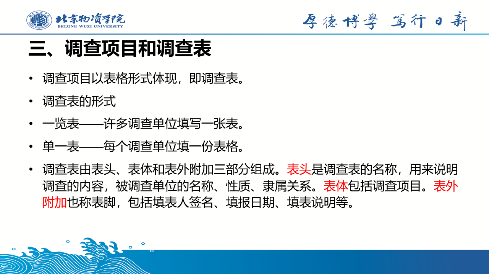

**第007页**

**第008页**

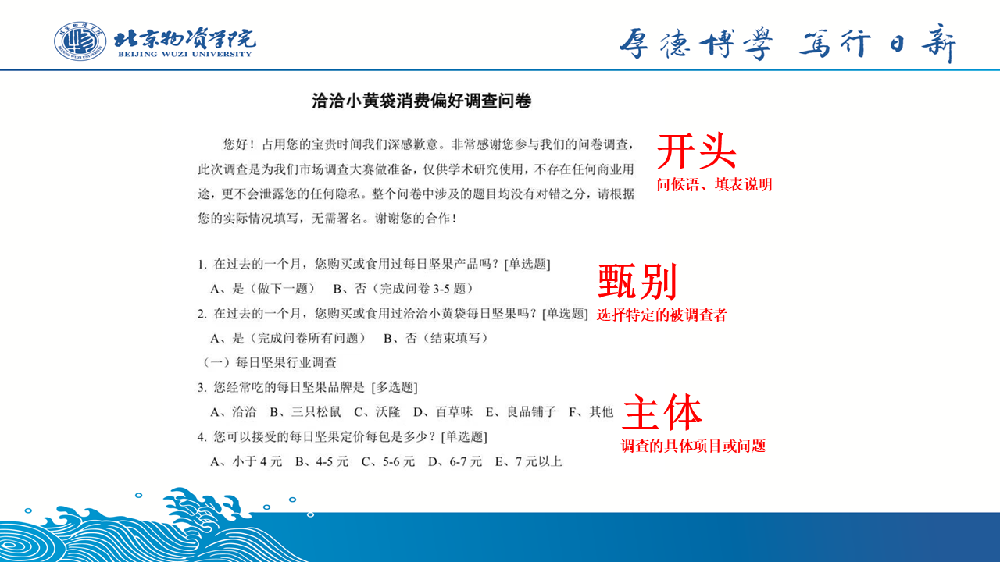

**第009页**

**第010页**

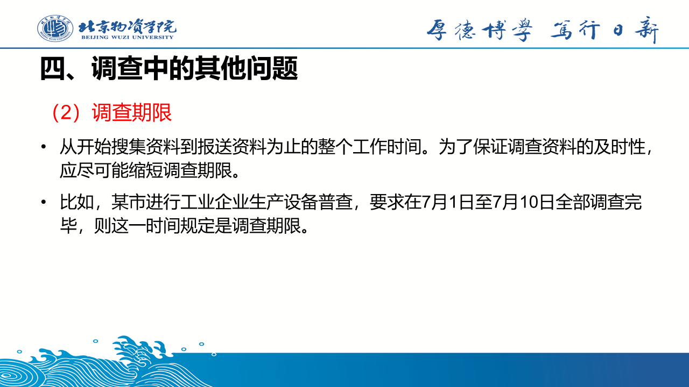

**第011页**

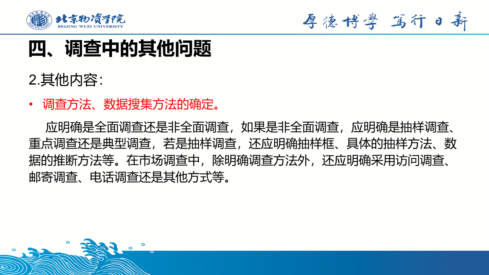

**第012页**

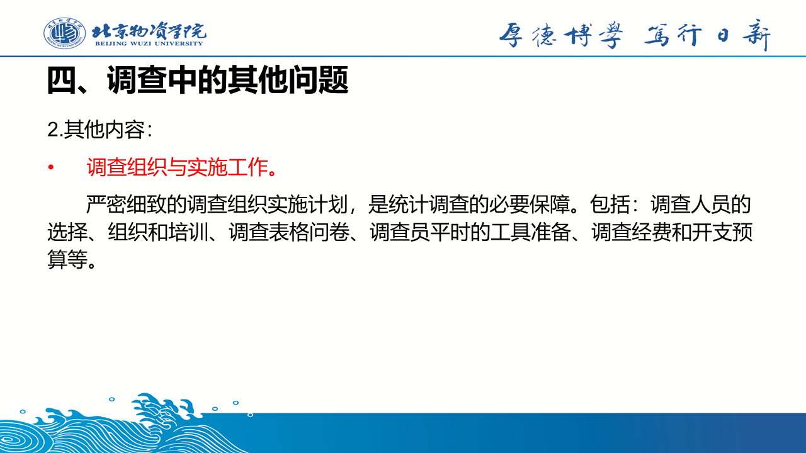

**第013页**

**第014页**

**第015页**

**第016页**

**第017页**

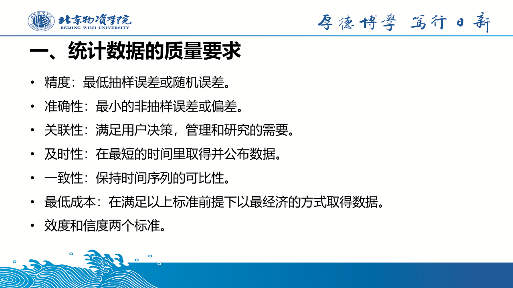

**第018页**

**第019页**

**第020页**

**第021页**

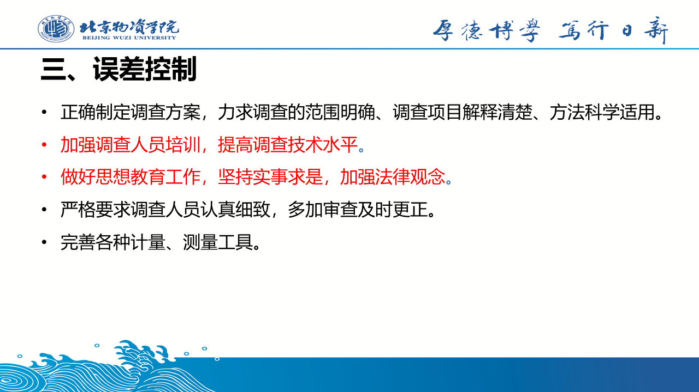

**第022页**

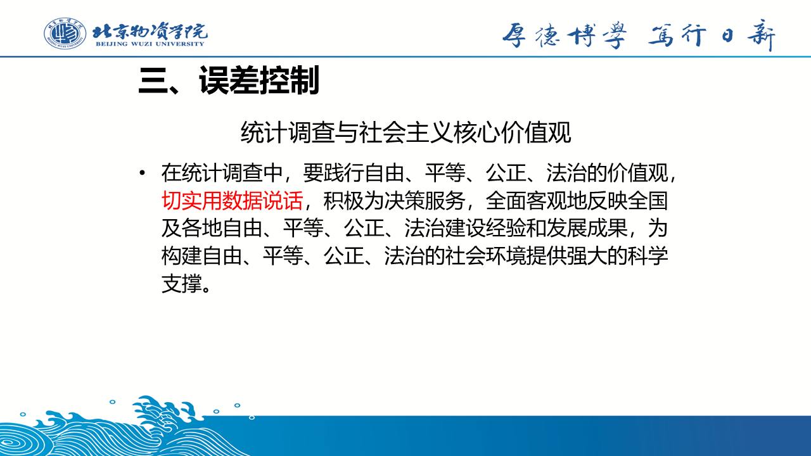

**第023页**

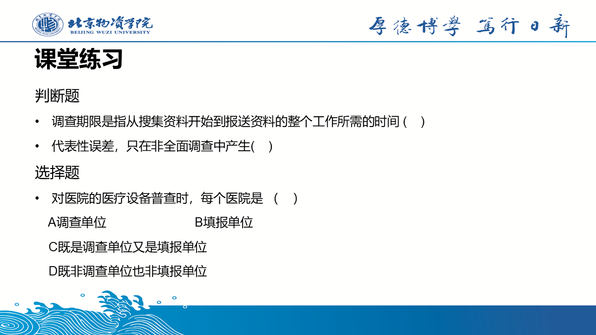

**第024页**

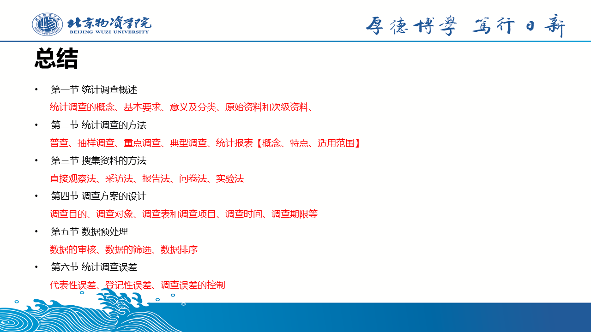

**第025页**

