# 第07章 抽样推断

> **图文一体**：文字笔记在下方；**课件每一页**见文末「配套课件（逐页图示）」。用 Markdown 预览即可，无需打开 pptx。

## 说明

课件目录为**第七章 抽样推断**；教学大纲单列「抽样与参数估计」（**期末重点、难点**）。本章无独立 PPT，内容来自大纲 + 第2章抽样方法 + 推断统计总论 + 实验课「区间估计」。

---

## 一、本章在干什么

由**样本**推断**总体**未知参数，并控制/估计**抽样误差**。与第8章（相关回归中的 t、F 检验）同属推断统计。

## 本章知识点树（总览 · 自上而下）

> 看章节骨架。下一节为**左→右知识导图**（含公式与题眼）。

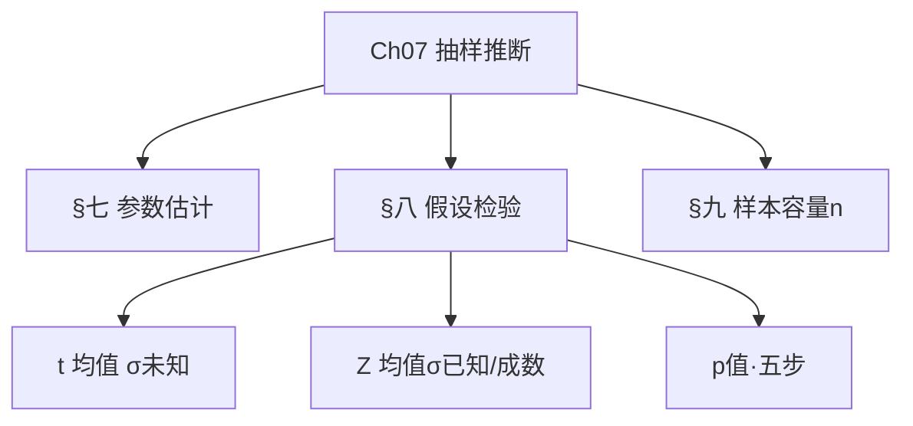

## 本章知识导图（左 → 右 · 对照笔记 § + 先读考点）

> **用法**：每章分 **上/中/下** 条带，条带内**从左往右**读；节点标注 **§ 小节号**（与正文一致）。含公式、题眼、易混提示。章内若仍觉缺项，以正文 § 为准补看。

```mermaid
flowchart TB
  T1["Ch07 · 上（概念·误差·μ·Δ）"]
  subgraph R1[" "]
    direction LR
    R((抽样推断)) --> A1["§二 概念"]
    A1 --> A1a["参数μ π 未知"]
    A1 --> A1b["统计量 x̄ p"]
    A1 --> A1c["重置/不重置抽样"]
    R --> A2["§三 误差"]
    A2 --> A2a["登记 非抽样"]
    A2 --> A2b["抽样 可估计"]
    A2 --> A2c["检验 α弃真 β取伪"]
    R --> A3["§四 μ"]
    A3 --> A3a["成数·均值公式"]
    A3 --> A3b["不重置修正"]
    R --> A4["§五 Δ"]
    A4 --> A4a["Δ=z·μ"]
    A4 --> A4b["置信度95%→z"]
  end
  T1 --> R1
  T2["Ch07 · 下（分布·估计·检验·n）"]
  subgraph R2[" "]
    direction LR
    R --> B1["§六 分布"]
    B1 --> B1a["x̄ 近正态"]
    B1 --> B1b["小样本 t"]
    R --> B2["§七 估计"]
    B2 --> B2a["点估计 x̄ p"]
    B2 --> B2a2["无偏·有效·一致"]
    B2 --> B2b["区间 x̄±Δ"]
    B2 --> B2c["成数区间"]
    R --> B3["§八 假设检验"]
    B3 --> B3a["五步 H0 H1 p值"]
    B3 --> B3b["均值 σ未知 t(n-1)"]
    B3 --> B3c["均值 σ已知 Z"]
    B3 --> B3d["成数 大样本Z"]
    B3 --> B3e["与区间估计对偶"]
    B3 --> B3f["→Ch8 t/F具体式"]
    R --> B4["§九 样本量n"]
    B4 --> B4a["给定Δ反推n"]
    B4 --> B4b["调查方案ABCDE"]
  end
  T2 --> R2
  R1 ~~~ R2
```

---

## 二、基本概念

| 概念 | 要点 |
|------|------|
| **总体指标（参数）** | μ、σ、π 等，通常未知 |
| **样本指标（统计量）** | \(\bar{x}\)、s、p，用于估计参数 |
| **重置抽样** | 放回，各次独立 |
| **不重置抽样** | 不放回，需有限总体修正系数 |
| **抽样方法** | 简单随机、分层、整群、等距（见第02章） |

---

## 三、两类误差（与第02章一致）

| | 代表性误差（抽样误差） | 登记性误差 |
|---|------------------------|------------|
| 性质 | 随机，可计算 | 系统，原则上可消除 |
| 出现 | 非全面调查固有 | 填报、汇总等人为 |

### 假设检验中的两类错误（了解）

| | 原假设 \(H_0\) **成立** | \(H_0\) **不成立** |
|---|------------------------|-------------------|
| **不拒绝** \(H_0\) | ✅ 正确 | ❌ **第二类错误 β**（取伪：该拒绝没拒绝） |
| **拒绝** \(H_0\) | ❌ **第一类错误 α**（弃真） | ✅ 正确 |

- **显著性水平 α**：控制**第一类错误**（如 α=0.05）  
- 与区间估计、回归 t/F 检验的 **p<α 拒绝** 是同一逻辑

---

## 四、抽样平均误差 \(\mu\)

**含义**：样本指标与总体指标的平均离差，反映估计的**平均准确性**。

**影响因素**：总体差异程度、样本量 **n**（n↑则 μ↓）、抽样组织方式（分层一般小于简单随机）、重置/不重置。

**抽样误差特点**（大纲）：非全面调查**固有**；服从一定规律，可计算、可控制。

### 常用公式（须会）

**重置简单随机，均值**：

\[
\mu_{\bar{x}} = \frac{\sigma}{\sqrt{n}}
\]

**不重置**（N 为总体容量）：

\[
\mu_{\bar{x}} = \sqrt{\frac{\sigma^2}{n} \cdot \frac{N-n}{N-1}}
\]

当 \(n/N < 5\%\) 时，可近似用 \(\sigma/\sqrt{n}\)。

**成数**（重置）：

\[
\mu_p = \sqrt{\frac{\pi(1-\pi)}{n}}
\]

---

## 五、抽样允许误差 \(\Delta\)

\[
\Delta = t \cdot \mu_{\bar{x}} \quad \text{或} \quad \Delta = z \cdot \mu_{\bar{x}}
\]

由置信水平查 \(t\) 或 \(z\)。

**常用置信度**（双侧）：

| 置信度 | 近似 \(z\) | 备注 |
|--------|-----------|------|
| 90% | 1.645 | |
| 95% | 1.96 | 实验课最常用 |
| 99% | 2.576 | |

小样本 σ 未知用 **t 分布**；大样本可近似用 z。

---

## 六、抽样分布（理解区间估计的前提）

- 样本统计量（如 \(\bar{x}\)、p）是**随机变量**，随样本而变  
- 重复抽样可得到统计量的**分布**（中心极限定理：大样本下 \(\bar{x}\) 近似正态）  
- 抽样平均误差 \(\mu_{\bar{x}}\) 描述该分布的**离散程度**

---

## 七、参数估计

### 1. 点估计

用 \(\bar{x}\) 估计 μ，用 p 估计 π。

| 优良性 | 含义（了解） |
|--------|----------------|
| **无偏性** | 反复抽样时，估计量的**平均**等于真值：\(E(\hat{\theta})=\theta\) |
| **有效性** | 在无偏估计中**方差最小**（更稳） |
| **一致性** | 样本量 \(n\to\infty\) 时，估计量**依概率收敛**于真值 |

\(\bar{x}\)、p 在大样本下常用；区间估计、检验不单独考「优良性」证明。

### 2. 区间估计（实验课核心）

**均值，σ 已知**（或大样本）：

\[
\bar{x} \pm z_{\alpha/2} \cdot \frac{\sigma}{\sqrt{n}}
\]

**均值，σ 未知**：

\[
\bar{x} \pm t_{\alpha/2}(n-1) \cdot \frac{s}{\sqrt{n}}
\]

**成数**：

\[
p \pm z_{\alpha/2} \cdot \sqrt{\frac{p(1-p)}{n}}
\]

**解释**：在置信度 \(1-\alpha\) 下，参数落在区间内的概率为 \(1-\alpha\)。

### 例题

n=36，\(\bar{x}=172\)，s=6，95% 区间：  
\(t \approx 2.03\)，\(\Delta = 2.03 \times 1 \approx 2.03\) → **(169.97, 174.03)**

---

## 八、假设检验（与第8章 t/F 检验同一套逻辑）

### 8.1 五步流程

| 步骤 | 内容 |
|------|------|
| 1 | 提出 \(H_0\)、\(H_1\) |
| 2 | 选择**检验统计量**（Z、t、F…）并写出其分布 |
| 3 | 给定显著性水平 \(\alpha\)，查临界值或算 **p 值** |
| 4 | 由样本计算统计量的值 |
| 5 | **p < α** 或落入拒绝域 → **拒绝** \(H_0\)；否则不拒绝 |

### 8.2 总体均值 μ 的检验（最常考 t）

| 情形 | 统计量 | 分布 |
|------|--------|------|
| σ **已知**（或大样本） | \(Z = \dfrac{\bar{x}-\mu_0}{\sigma/\sqrt{n}}\) | 标准正态 |
| σ **未知** | \(t = \dfrac{\bar{x}-\mu_0}{s/\sqrt{n}}\) | **t(n−1)** |

**例**：\(H_0:\mu=\mu_0\)，\(H_1:\mu\neq\mu_0\)，n=36，\(\bar{x}=172\)，s=6 → 算 t，与 \(t_{0.025}(35)\) 比较，或看 p 值。

### 8.3 总体成数 π 的检验

大样本常用：

\[
Z = \frac{p-\pi_0}{\sqrt{\pi_0(1-\pi_0)/n}} \approx N(0,1)
\]

### 8.4 与区间估计、与第8章的关系

| 联系 | 说明 |
|------|------|
| **对偶** | 双侧检验水平 α 与置信度 \(1-\alpha\) 对应；\(\mu_0\) 落在 95% 置信区间内时，一般不拒绝 \(H_0:\mu=\mu_0\) |
| **第8章** | 对 **ρ** 用 **t**；对回归 **b** 用 **t**；对**整条方程/多元模型**用 **F**（F 统计量 = MSR/MSE） |

**注意**：第7章讲**推断框架**；第8章讲**相关回归里的 t/F 具体公式**（见第08章 §五·8）。

---

## 九、样本容量 n

**均值**（重置，给定 \(\Delta\)）：

\[
n = \frac{z_{\alpha/2}^2 \cdot \sigma^2}{\Delta^2} \quad \text{（向上取整）}
\]

**成数**（π 未知取 0.5 最保守）：

\[
n = \frac{z_{\alpha/2}^2 \cdot \pi(1-\pi)}{\Delta^2}
\]

**规律**：n 越大 → \(\mu\) 越小 → 区间越窄。

---

## 先读：本章习题考点（易懂版）

（2.1 习题与第2章重复，此处只列考点）

- **调查方案内容**：目的、对象、单位、时间、项目 **ABCDE**。
- **调查目的**：明确**要解决什么问题、为何调查（C）**，不是划总体界限（A）也不是调查表（D）。
- **普查/抽样/重点/典型**辨析同第2章。
- **等距、整群、分层减误差**同第2章。
- **推断统计**（本章核心）：样本估计总体、置信区间、假设检验（见正文 § 公式）。
- **两类错误**：拒绝真 \(H_0\)→**α 弃真**；不拒绝假 \(H_0\)→**β 取伪**（与 p<α 同一逻辑）。
- **点估计优良性**：无偏、有效、一致（认名即可，见 §七 表）。

---

## 习题逐题精讲（答案与 `_提取全文` 一致）

> **用法**：先读上文「先读：习题考点」理解概念 → 再逐题对答案。每题含「怎么理解」，不空喊「见正文」。

### 2.1 抽样与调查（推断基础）

**1.** 统计整理所涉及的资料( )。 A：原始数据 B：次级数据 C：原始数据和次级数据 D：统计分析后的数据
- **答案**：C
- **怎么理解**：次级数据：他人已加工发布（统计局网站） 原始数据：一次调查/实验取得
- **正文位置**：见本章「先读：习题考点」+ 上文公式/表格小节

**2.** 小吴为写毕业论文去收集数据资料，（ ）是次级数据。 A：班组的原始记录 B：车间的台帐 C：统计局网站上的序列 D：调查问卷上的答案
- **答案**：C
- **怎么理解**：次级数据：他人已加工发布（统计局网站） 原始数据：一次调查/实验取得
- **正文位置**：见本章「先读：习题考点」+ 上文公式/表格小节

**3.** 科学家为了解土壤的理化性质，在实验室中测定土壤样品中的重金属含量，得到数据为( )。 A：统计台帐资料 B：第二手资料 C：普查资料 D：原始数据
- **答案**：D
- **怎么理解**：次级数据：他人已加工发布（统计局网站） 原始数据：一次调查/实验取得 普查：全面、专门、一次性 BCE
- **正文位置**：见本章「先读：习题考点」+ 上文公式/表格小节

**4.** 统计调查方案的主要内容包括( )( )( )( )( )。 A：调查的目的 B：调查对象 C：调查单位 D：调查时间 E：调查项目
- **答案**：ABCDE
- **怎么理解**：调查方案：目的、对象、单位、时间、项目（ABCDE）
- **正文位置**：见本章「先读：习题考点」+ 上文公式/表格小节

**5.** 明确调查目的，就是( )。 A：明确总体界限，划清调查的范围，区别应调查和不应调查的现象。 B：明确调查单位的特征。 C：明确统计调查要解决什么问题，为什么要进行统计调查。 D：就是把若干调查项目按照一定的顺序排列在表格上，就形成了调查表。
- **答案**：C
- **怎么理解**：调查目的=要解决什么问题、为何调查（C）
- **正文位置**：见本章「先读：习题考点」+ 上文公式/表格小节

**6.** 全国工业普查中( )( )( )( )( )。 A：所有工业企业是调查对象 B：每一个工业企业是调查单位 C：每一个工业企业是报告单位 D：每个工业企业的总产值是统计指标 E：全部国有工业企业数是统计指标
- **答案**：ABCE
- **怎么理解**：指标：总体的数量特征 普查：全面、专门、一次性 BCE
- **正文位置**：见本章「先读：习题考点」+ 上文公式/表格小节

**7.** 调查时限是指（ ） A：调查资料所属的时间 B：进行调查工作的期限 C：调查工作登记的时间 D：调查资料的报送时间
- **答案**：B
- **怎么理解**：调查期限=工作期限；调查时间=资料所属时间
- **正文位置**：见本章「先读：习题考点」+ 上文公式/表格小节

**8.** 普查是（ ）（ ）（ ）（ ）（ ）。 A：非全面调查 B：专门调查 C：全面调查 D：经常性调查 E：一次性调查
- **答案**：BCE
- **怎么理解**：普查：全面、专门、一次性 BCE
- **正文位置**：见本章「先读：习题考点」+ 上文公式/表格小节

**9.** 全面调查形式有（ ）（ ）（ ）（ ）（ ）。 A：重点调查 B：抽样调查 C：典型调查 D：统计报表 E：普查
- **答案**：DE
- **怎么理解**：普查：全面、专门、一次性 BCE 重点调查：选权重大单位 典型调查：有意识选典型；解剖麻雀、划类选典
- **正文位置**：见本章「先读：习题考点」+ 上文公式/表格小节

**10.** 为掌握商品销售情况，对占该市商品销售额80%的五个大商场进行调查，这种调查方式属于( )。 A：普查 B：抽样调查 C：重点调查 D：统计报表
- **答案**：C
- **怎么理解**：普查：全面、专门、一次性 BCE 重点调查：选权重大单位
- **正文位置**：见本章「先读：习题考点」+ 上文公式/表格小节

**11.** 有意识地选择三个农村点调查农民收入情况，这种调查方式属于（ ）。 A：普查 B：典型调查 C：抽样调查 D：重点调查
- **答案**：B
- **怎么理解**：普查：全面、专门、一次性 BCE 重点调查：选权重大单位 典型调查：有意识选典型；解剖麻雀、划类选典
- **正文位置**：见本章「先读：习题考点」+ 上文公式/表格小节

**12.** 典型调查可以细分为( )( )( )( )( )。 A："解剖麻雀"式调查 B："面面俱到"式的调查 C："划类选典"式的调查 D："随机"式的调查 E："好中选优"式的调查
- **答案**：AC
- **怎么理解**：典型调查：有意识选典型；解剖麻雀、划类选典
- **正文位置**：见本章「先读：习题考点」+ 上文公式/表格小节

## 自测

1. 先遮答案做一遍 → 再对「习题逐题精讲」。
2. 错题回到「先读：习题考点」和正文公式段。

## 配套课件（逐页图示）

> **不用另开 PPT/PDF**：以下与课件页一一对应，在 Cursor / VS Code 中打开本 Markdown 并**预览**（Ctrl+Shift+V）即可图文一起看。

### PPT-2.2关联抽样调查

**第001页**

**第002页**

**第003页**

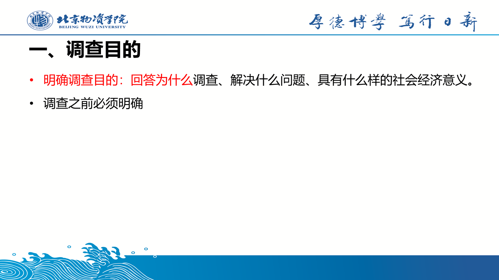

**第004页**

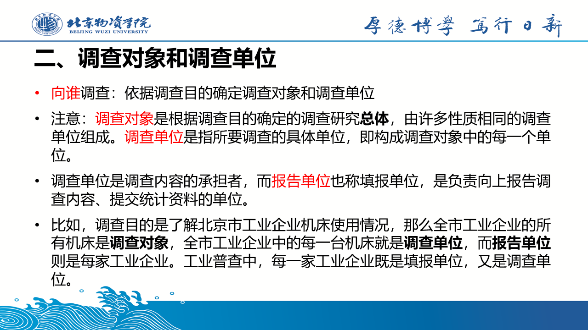

**第005页**

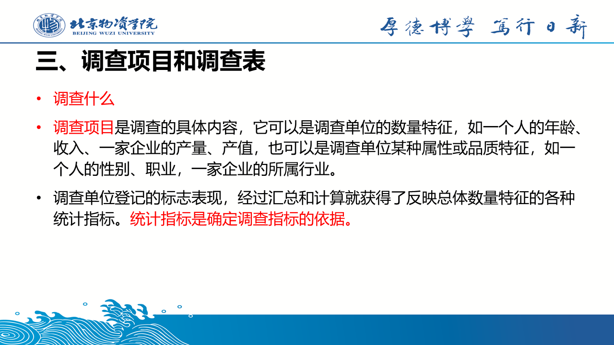

**第006页**

**第007页**

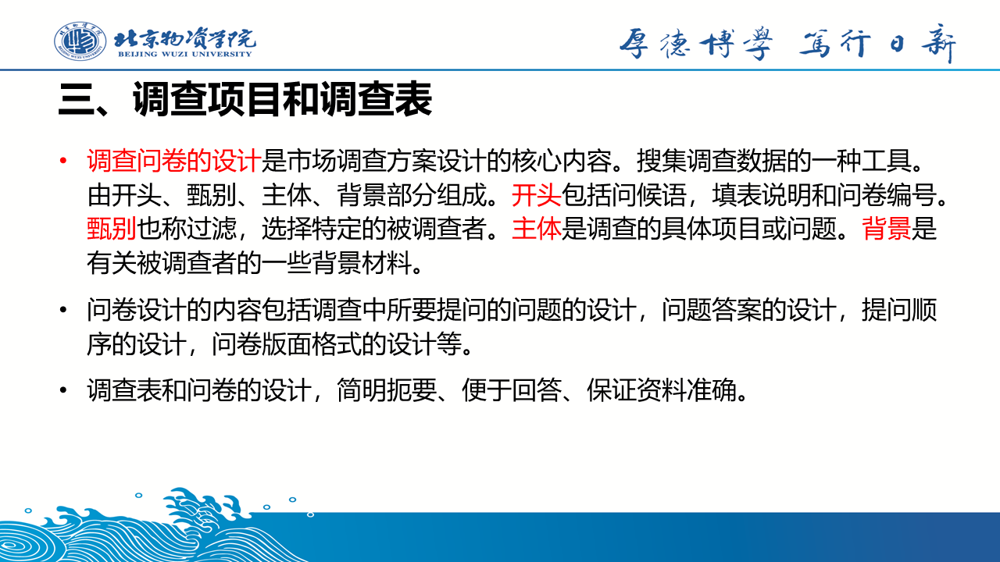

**第008页**

**第009页**

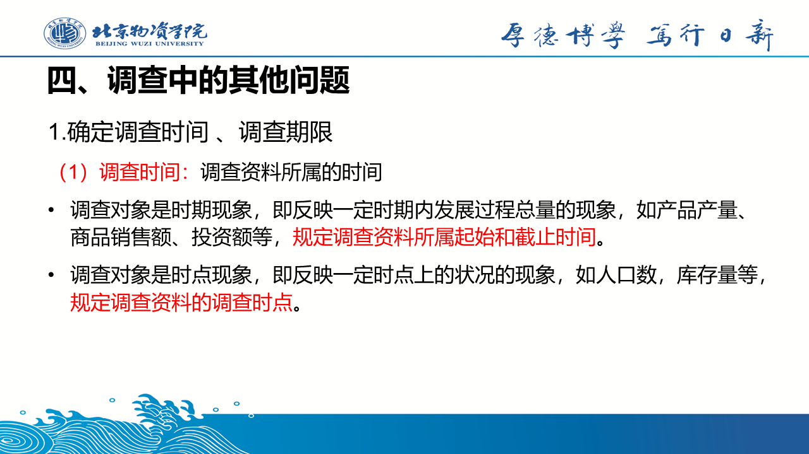

**第010页**

**第011页**

**第012页**

**第013页**

**第014页**

**第015页**

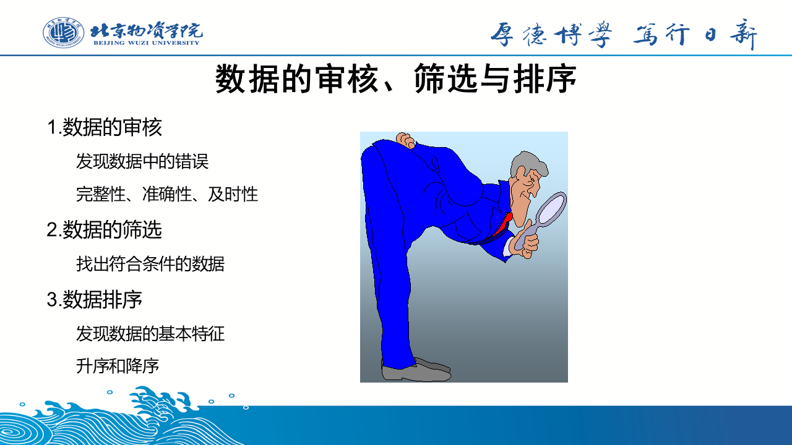

**第016页**

**第017页**

**第018页**

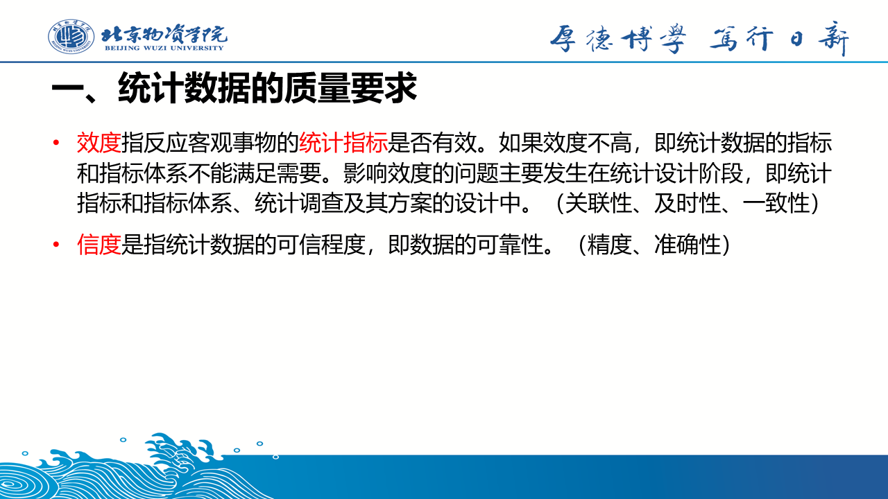

**第019页**

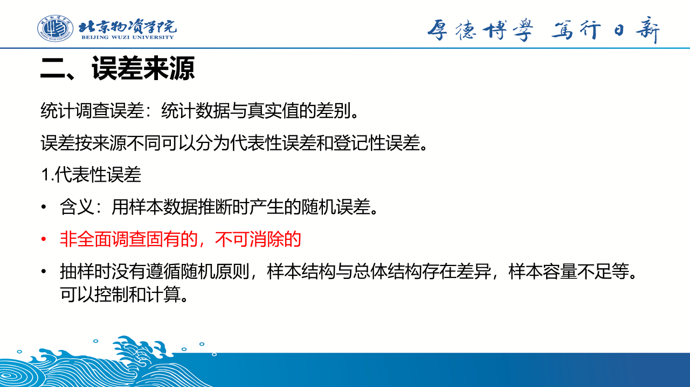

**第020页**

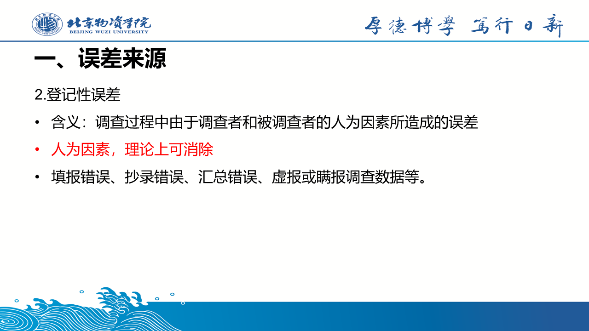

**第021页**

**第022页**

**第023页**

**第024页**

**第025页**

